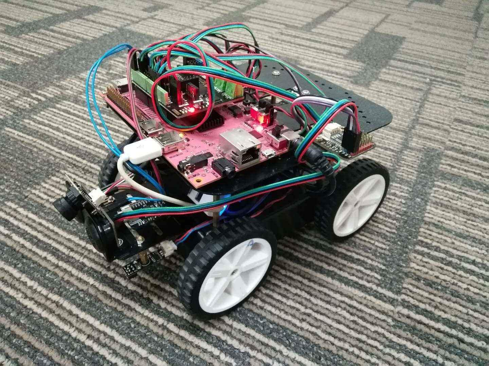

# Robot Car Development Platform for PYNQ

This repo contains the pip install package for Robot Car Development Platform for PYNQ. It's only support PYNQ Z2 board.
 

## Quick Start

In order to install it on your PYNQ board, connect to the board, open a terminal and type:

### Online Install
```shell
# (on PYNQ v2.3 only)
sudo pip3 install git+https://github.com/xupsh/PYNQ-Car.git
```
### Standalone Install
```shell
# (on PYNQ v2.3 only)
cd PYNQ-Car
sudo python setup.py install
```

NOTE: This command must be run as root.

# USB-Serial driver
There is also two USB-serial drivers including in this repository, which will be helpful for ROS operation. To use the driver, run the following code in a terminal.
```shell
# (on PYNQ v2.3 only)
cd ~/jupyter_notebooks/driver
sudo insmod usbserial.ko
sudo insmod cp210x.ko
```